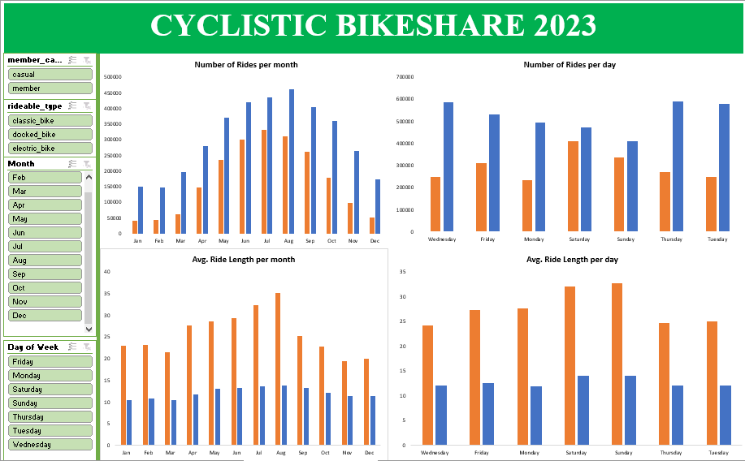
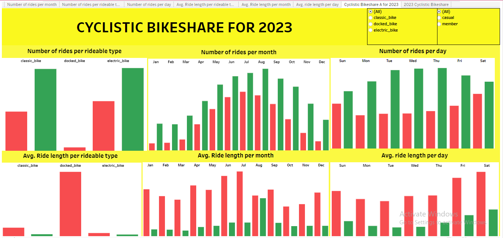

# CYCLISTIC BIKESHARE ANALYSIS

## BUSINESS TASK STATEMENT
**To ascertain how annual members and casual riders use bikes differently.** 

## EXECUTIVE SUMMARY
Cyclistic is a bike-share program with more than 5,800 bicycles and 600 docking stations. 
They also have annual members and casual riders. Annual members subscribe annually while casual riders just hire bikes at will. Cyclistics wants to reduce the cost of advertising by converting casual riders to annual member

### MAJOR POINT FOR ANALYSIS
1.  Comparing the average ride length of annual members and casual riders by month and by day
2.  Comparing the number of rides of annual members and casual riders by month and by day
3.  Checking the most preferred rideable bike type mostly used by both parties

### DATA SOURCE
[Divvy-tripdata](https://divvy-tripdata.s3.amazonaws.com/index.html)

### VISUALIZATION ON EXCEL

[Tabeau Visualization](https://public.tableau.com/views/2023CyclisticBikeshare/CyclisticBikeshareAfor2023?:language=en-US&:sid=&:redirect=auth&:display_count=n&:origin=viz_share_link)
